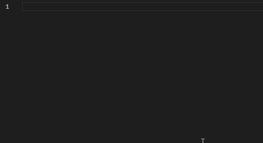
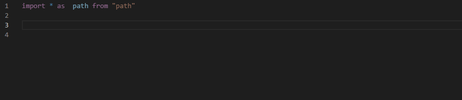
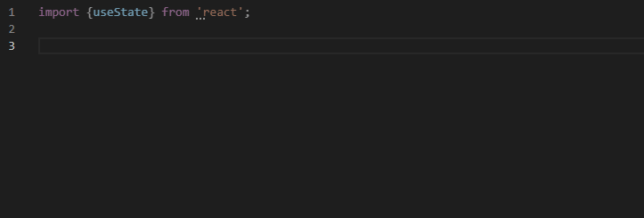
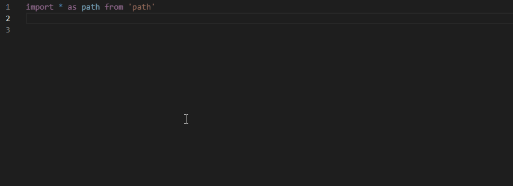
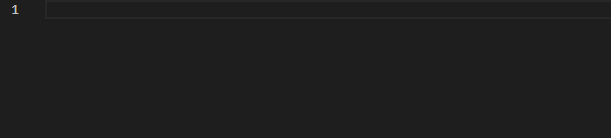

# RushPlate 
Templates for TypeScript, React and Redux projects that help you write your code faster.
_____
This VS Code extension includes templates for TypeScript, React and Redux projects. Templates are easy-to-memorize character sequences that expand into boilerplate code such as class or property definition. Templates help you write code faster. 

## Features

### Two Ways to Expand a Template

**RushPlate** allows you to quickly expand a template. If you know the template name, just type it and press **Space**.

You can also choose the required item from the IntelliSence list and press **Enter**.

### Context-dependent Templates 

**RushPlate** analyzes code and expands different templates depending on the context. For example, **RushPlate** can create the following code for the "c" template: 

  1. A class with a constructor, if you expand the template in a file root. 
  2. A constant, if you expand the template inside a constructor. 

### Dependent Namespace Declaration

**RushPlate** adds dependent imports to the top of a file, where other imports are located. It also checks if similar modules are already exist and adds only modules that are not declared in the file.

### Linked Identifiers

If a template contains linked identifiers used several times in code, you can quickly change identifiers’ name in one link after the template expansion and **RushPlate** will change text  in other links.
**RushPlate** also keeps links active constantly. You can remove the caret from links, for example, move the caret to another file, and then, go back and continue your change.

### Different Prefixes for the Same Templates

**RushPlate** can expand templates using short combinations such as "c" (to add a class with a constructor, or constant), "rc" (to add a React component), " rpc" (to add a React Pure component), and others. If you prefer to use a more understandable and standardized syntax, you can expand the same templates using the following mnemonics: "class with constructor", "react component", and "react pure component".

## Usage

Type a template name, for example **c**, and press **Space** or choose the "c" item from  IntelliSense and press **Enter**. **RushPlate** creates a class with a constructor and suggests its name. Press **Enter** to apply this suggestion or change this name. 

The screencast below shows "c" and "afn" template expansions:

## Code Templates

The following tables list all available templates for TypeScript, React and Redux:

### TypeScript Templates

#### Types Creation

| Template  | Description  | 
|---|---|
| **c**  | Creates a class with a constructor. | 
| **c,**  | Creates a class without a constructor. |                         | **ci**  | Creates a class that implements an interface with a constructor. | 
| **ci,**  | Creates a class that implements an interface without a constructor. |
| **cx**  | Creates a class with a constructor that extends another class.   |
| **cx,**  | Creates a class without a constructor that extends another class.   |
| **i**  | Creates an interface. |
| **e**  | Creates an enum. |
| **cc**  | Creates a constructor. |

#### Type Reference

| Member Kind  | String   | Number| Boolean | Object| Any| Clipboard
|---|---|---|---|---|---|---|
| **Type Reference**  | ts | tn | tb | to | ty| tp|
| **Array Type Reference**  | tas | tan | tab | tao | tay| tap|

#### Members Declaration

##### Properties and Functions

| Member Kind  | Void |String   | Number| Boolean | Object| Any| Clipboard
|---|---|---|---|---|---|---|---|
| **Property**  | - | ps | pn | pb | po | py| pp|
| **Property of an Array of** | -  | pas | pan | pab | pao | pay| pap|
| **Read-only Property** | - | rs | rn | rb | ro | ry| rp|
| **Read-only Property of an Array of** | - | ras | ran | rab | rao | ray| rap|
| **Function** |f | fs | fn | fb | fo | fy| fp|
| **Function of an Array of** |  | fas | fan | fab | fao | fay| fap|
| **Arrow Function** | af | afs | afn | afb | afo | afy| afp|
| **Arrow Function of an Array of** | - | afas | afan | afab | afao | afay| afap|
| **Async Function** | yf | yfs | yfn | yfb | yfo | yfy| yfp|
| **Async Function of an Array of** | - | yfas | yfan | yfab | yfao | yfay| yfap|
| **Async Arrow Function** | yaf | yafs | yafn | yafb | yafo | yafy| yafp|
| **Async Arrow Function of an Array of** | - | yafas | yafan | yafab | yafao | yafay| yafap|

##### Constants, Variables, Fields, and Parameters

| Member Kind  | String   | Number| Boolean | Object| Any| Clipboard
|---|---|---|---|---|---|---|
| **Constant**  | qs | qn | qb | qo | qy| qp|
| **Constant of Array of**  | qas | qan | qab | qao | qay| qap|
| **Variable/Field/Parameter**  | vs | vn | vb | vo | vy| vp|
| **Variable/Field/Parameter of Array of**  | vas | van | vab | vao | vay| vap|
| **Variable/Field/Parameter with a new**  | ns | nn | nb |  | | |
| **Variable/Field/Parameter with a new Map**  | nmss | nmsn | nmsb |  |nmsa | nmsp|

#### Import/Export 

| Template  | Description  | 
|---|---|
| **im**  | Imports a named module. | 
| **ia**  | Imports everything from the specified module as an alias. | 
| **id**  | Imports a default module. | 
| **ip**  | Imports a module part. | 
| **ipa**  | Imports a named part as an alias. | 
| **xd**  | Exports a default declaration. |
| **xp**  | Exports a module portion.  |
| **xpf**  | Exports a declaration portion from a specified module.  |
| **xf**  | Exports a function. |
| **xdf**  | Exports a default function. |
| **xc**  | Exports a class with a constructor. |
| **xc,**  | Exports a class without a constructor. |

#### Conditionals & Control Statements

| Template  | Description  | 
|---|---|
| **fof**  | Creates a for-of loop with an element iterator. | 
| **fi**  | Creates a for loop with an index iterator. | 
| **fri**  | Creates a for loop with an iterator variable named "i". | 
| **frix**  | Creates a for loop with an iterator variable named "index".
| **frj**  | Creates a for loop with an iterator variable named "j". |
| **frx** | Creates a for loop with an iterator variable named "x". |
| **fry**  | Creates a for loop with an iterator variable named "y". |
| **frz**  | Creates a for loop with an iterator variable named "z". |
| **w**, **while**  | Creates a while statement. |
| **if**  | Creates an if statement. |
| **ife**, **ifl**, **fl**  | Creates an if-else statement. |
| **sw**, **switch**  | Creates a switch statement. | 
| **c**, **case**  | Creates a case statement. | 
| **tc**, **try catch** | Creates a try-catch block. | 
| **tcf**, **try catch finally**  | Creates a try-catch-finally block.
| **tf**, **try finally**  | Creates a try-finally block. |
| **tne**, **throw error**  | Creates a statement that throws an error. |

### TypeScript React Templates

#### Import

| Template  | Description  | 
|---|---|
| **ira**, **react import all**  | Imports as React (all). |
| **ir**, **react import namespace**  | Imports a React namespace. |
|**irra**, **react router import all**  | Imports as React Router (all). | 
|**irb**, **react import browser router** | Imports a React Browser Router. | 
|**ib**, **react import browser router and route** | Imports a Browser Router from react-router-dom. | 
|**ib3**, **react import browser router 3-part** | Imports a React Router, a 3-part combo. | 
|**ib4**, **react import browser router 4-part** | Imports a React Browser Router, 4-part combo. | 
|**ibl**, **react import link** | Imports a React Browser Router - Link. | 
|**ibn**, **react import navlink** | Imports a React Browser Router - Nav Link. | 
|**ibr**, **react import route** | Imports a React Browser Router - Route. | 
|**ibs**, **react import switch** | Imports a React Browser Router - Switch. | 
|**ipt**, **react import prop types** | Imports PropTypes. |
|**irc**, **react import component** | Import a React Component. |
|**irc,**, **react import namespace and component** | Imports  React, { Component } |
|**ird**, **react dom import namespace**| Imports a ReactDOM. |
|**irpc**, **react import pure component**|Imports a React PureComponent. |
|**irpc,**, **react import namespace and pure component** |Imports React, { PureComponent }. |
|**irfc**, **react import function component** |Imports a  React FunctionComponent |
|**irr**, **react import useRef** |Imports a React useRef. |
|**irr,**, **react import namespace and useRef** |Imports React, {useRef}. |
|**irm**, **react import memo**|Imports a React memo. |
|**irm,**, **react import namespace and memo** |Imports React, { memo }. |
|**irs**, **react import usestate** |Imports a React useState. |
|**irs,**, **react import namespace and usestate** |Imports  React, {useState}. |
|**irse**, **react import usestate useeffect** |Imports a React useState and useEffect. |
|**irse,**, **react import namespace and usestate useeffect** |Imports  React, { useState, useEffect }. |

#### Create

| Template  | Description  | 
|---|---|
|**rc**, **react component** |Creates a React component declaration. |
|**rcs**, **react component with state** |Creates a React component with the state declaration. |
|**rpc**, **react pure component** |Creates a React PureComponent declaration. |
|**rpc**, **react pure component** |Creates a React PureComponent declaration. |
|**rpcs**, **react pure component with state** |Creates a React PureComponent with the state declaration. |
|**rfc**, **react function component** |Creates a React function Component. |
|**raf**, **react arrow function component** |Creates a React arrow function component. |
|**rsf**, **react stateless function component** |Creates a React stateless function component declaration. |
|**c**, **react component constructor** |Creates a React component constructor declaration. |
|**cwm**, **react componentWillMount** |Creates a componentWillMount method declaration. |
|**cdm**, **react componentDidMount** |Creates a componentDidMount method declaration. |
|**cwum**, **react componentWillUnmount** |Creates a componentWillUnmount method declaration. |
|**scu**, **react shouldComponentUpdate** |Creates a shouldComponentUpdate method declaration. |
|**bnd**, **react bind method call** |Creates a bind method call. |
|**ss**, **react setState** |Creates a setState method call. |
|**us**, **react useState** |Creates a useState method call. |
|**ue**, **react useEffect** |Creates a useEffect method call. |

### TypeScript Redux Templates

| Template  | Description  | 
|---|---|
| **ixa**, **redux import all**| Imports as a Redux (all). |
| **ixc**, **redux import connect**| Imports a Redux connect. |
| **xc**, **redux component**| Creates a Redux component. |
| **xcd**, **redux component with dispatch**| Creates a Redux component with dispatch. |
| **xcp**, **redux component with own props**| Creates a Redux component with dispatch and ownProps. |
| **xms**, **redux map state**| Creates a mapStateToProps function. |
| **xmsp**, **redux map state and props** | Creates a mapStateToProps function with component properties. |
| **xmd**, **redux map dispatch**| Creates a mapDispatchToProps function. |
| **xmdb**, **redux map dispatch with bind**| Creates a mapDispatchToProps function with bindActionCreators. |
| **xcon**, **redux connect**| Creates a React Redux connect. |
| **xfc**, **redux function component**| Creates a Redux function component. |

### TypeScript Action Templates

| Template  | Description  | 
|---|---|
| **xac**, **redux actions create**| Exports a Redux action creator. |
| **xbac**, **redux actions bind**| Returns the bindActionCreators. |

### TypeScript Reducer Templates

| Template  | Description  | 
|---|---|
| **xr**, **redux reducer**| Reduxes a reducer declaration. |
| **xcr**, **redux combine reducers**| Reduxes a combineReducers declaration. |

### TypeScript Middleware Templates

| Template  | Description  | 
|---|---|
| **mw**, **middleware function**| Creates a Middleware function. |
| **mwcl**, **middleware crash logger**| Creates a crash logger middleware. |
| **xsc**, **redux create store** | Creates a Redux store. |
| **xcsm**, **redux create store with middleware** | Creates a Redux store with middleware.

### TypeScript Console Templates

| Template  | Description  | 
|---|---|
| **clt**, **console time**| Creates a console log time. |
| **cli**, **console info** | Creates a console log info. |
| **cle**, **console error** | Creates a console log error.
| **clx**, **console exception** | Creates a console log exception.
| **cl**, **cl&#96;**, **console log backtick** | Creates a Simple console.log call (backtick quotes).
| **cl&#92;**, **console log string** | Creates a Simple console.log call (double quotes).
| **cl'**, **console log string** | Creates a Simple console.log call (single quotes).
| **cl-**, **console log instance** | Creates a Simple console.log call.
| **cloo**, **console object object** | Creates a console.log call sending out the specified value as a string.

