# Rush Snippets

#### Code Snippets for TypeScript, JavaScript, React and Redux projects. 

Rush Snippets is a collection of easy-to-recall VS Code shortcuts that expand into larger blocks of boilerplate code developers create all the time. 

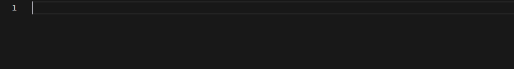

Rush Snippets can help you declare code more efficiently, with: 

* Fewer keystrokes, 
* Fewer mistakes, 
* Less physical strain, and 
* An overall lower cognitive load.

[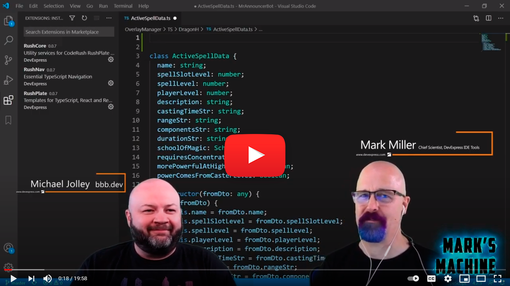](https://youtu.be/A7bAdll37qA)

## Features

### Full Support for React, Redux, TypeScript, and JavaScript Coding

**Rush Snippets** includes complete support for the React and Redux frameworks, making it easy to create components with state and properties. Often-needed boilerplate code is now only a few keystrokes away, with Rush Snippets guiding you through the parts that need changing. 

**Rush Snippets** also includes everything you need to write common code structures with greater efficiency, so you can declare types, classes, interfaces, functions, variables, parameters, properties, and constants **all in a fraction of the time** (and keystrokes) as you do now.

**Rush Snippets** are so effective, not only can they save you time, they can also help significantly reduce the amount of physical strain developers normally experience across their careers.

### Context-aware Code Creation 

**Rush Snippets** analyzes code and expands snippets based on surrounding context. For example, to declare a new **variable** that's a **number**, just type "**vn**" ("**v**" for **v**ariable, and "**n**" for **n**umber). See? Easy to recall!

Behind the scenes, Rush Snippets includes **six different expansions** for this snippet, so you can use that same "**vn**" snippet to declare **field variables**, **local variables**, and **parameters**:

Rush Snippets will also add missing commas to parameter declarations if needed.

What you get depends on where you are in the code.

### Two Ways to Expand a Snippet

**Rush Snippets** allows you to quickly expand a snippet if you already know the shortcut (like "**vn**" to create a **v**ariable that is a number, or "**vs**" to create a **v**ariable that's a **s**tring). Just type it where you want it and press **Space**.

You can also use Intellisense to find the expansion you need. Just type in a bit of what you're looking for (like "react component"), and press **Enter** on the Rush Snippet you want to expand.

### Automatic Namespace Declaration

**Rush Snippets** adds missing dependent imports (if needed by the code snippet) to the top of the file, grouped with existing imports. It also checks if similar module imports already exist, and will only add modules that are not yet declared in the file.

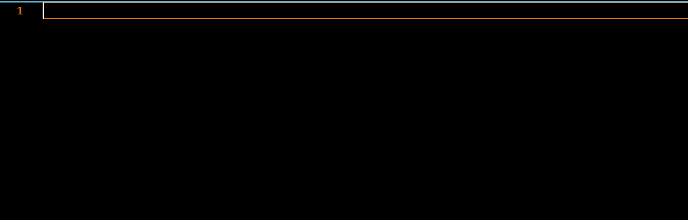

### Linked Identifiers

If a snippet contains linked identifiers (repeated text that needs to stay in sync), you can quickly change that repeated text in one step. With **Rush Snippets**, all the links stay in sync, even if you move the caret away. 

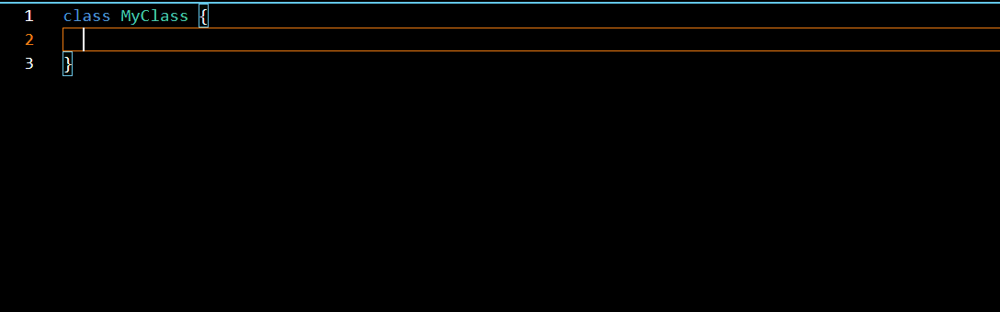

You can break this sync by pressing **Enter** while the caret is on a link.

### Easy Access to Shorter Variations

Sometimes you need **less** than the full boilerplate snippet. If you need less code, just add a **comma** to the end of the sequence. 

Examples:

* The "**c**" snippet expands to a class **with a constructor**, while "**c,**" expands to a class **without a constructor**. 
* The "**.d**" snippet expands to a \<div\> tag **with a class property**, while "**.d,**" expands to a \<div\> tag **without a class property**.

If you find any examples of shorter snippets we are missing, please let us know (support@devexpress.com)!

### The Shortest Path from Thought to Code

You can expand **Rush Snippets** with ultra-short sequences, such as "**c**" (to add a **c**lass with a constructor), "**rc**" (to add a **R**eact **c**omponent), "**rpc**" (to add a **R**eact **P**ure **c**omponent), and others. Every snippet name was carefully chosen to be easy to remember, with mnemonics that don't collide with other mnemonics. The result is a **powerful new way** to create code with **substantially less effort**.

### Easy to Find

Rush Snippets also includes searchable descriptive names, such as "class with constructor", "readonly property bool", "react component", and "react pure component". So if you know what you want, just type it, and then find the appropriate Rush Snippet in Intellisense:
 

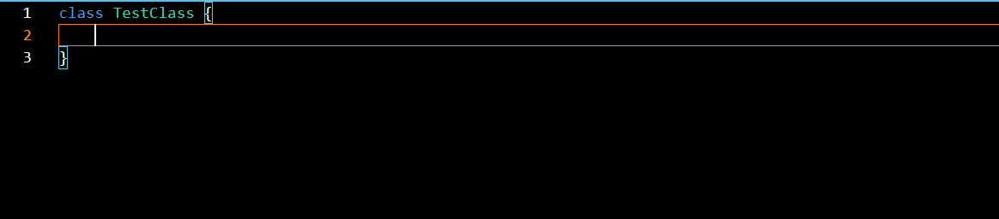

### Fully Supported and in Active Development

Rush Snippets is fully supported by [DevExpress](https://www.devexpress.com), and is in active development by the same team who creates [CodeRush for Visual Studio](https://www.devexpress.com/coderush). Expect future updates and support for more frameworks in coming releases.

## Usage

* It's simple. Just type a snippet shortcut where you need it. For example, **c**, to create a new **c**lass.

* Press **Space** or choose the Rush Snippet from Intellisense and press **Enter**. **Rush Snippets** replaces whatever you've typed with the snippet expansion. For example, creating a complete class declaration with a constructor.

* Some snippets ask for changes, using a highlighted box to indicate a prompt. Just type what you need (e.g., name the newly-declared class) and press **Enter** to move on.

The screencast below shows expansions for "**f**" (void function), **vb** (a variable of boolean), **vs** (a variable of string), **tn** (a type reference of number), and **r0** (return 0) templates:

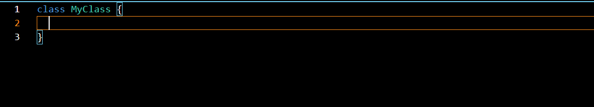

You can also expand a snippet with the **Tab** key, or a different custom keyboard shortcut if you prefer (more on this below).

## Core Mnemonics - Quick Start

To get up to speed quickly, know this:

* To declare any type, member, or variable:
    * Enter the **first letter** of that thing you want to create (like **c** for **c**lass, **t** for **t**ype, **f** for **f**unction, **v** for **v**ariable, or **p** for **p**roperty).
    * If that declaration **has a type** (including function return types), enter the **first letter** of that **type** next (like **b** for **b**oolean, **n** for **n**umber, **s** for **s**tring, or **p** to **p**aste the type that is on the clipboard).
* For constants, start with "**q**" and follow it with the first letter/symbol of the type or initial value you want it to have (try **qs**, **qt**, **q0**) Just remember, "**Q**onstants".
* Remember the "**v** for **v**ariable" rule includes **parameters**, **field variables**, and **locals**. You can use the same shortcuts in all of these places where you need a variable.
* To **return** from a function, use "**r**" on an empty line, and optionally follow it with:
    * The first letter of the value you want to return (**f** for **f**alse, **t** for **t**rue, **d** for \<**d**iv\>, or **n** for **n**ull).
    * The number **0**, **1**, or **-1** to return that number.
    * Any TypeScript string delimiter (**"**, **'**, or **`**) to return a string.
* For **i**mports, start with "**i**". For e**x**ports, start with "**x**".
* For HTML in TypeScript and JavaScript, start with a "**.**", then follow it with the first letter of what you want to create (like **.d** for \<**d**iv\>, or **.i** for \<**i**mg\>).
* A **trailing comma** means "I want a shorter version" of this snippet. 

#### More on functions:

* If you need an **arrow** (=>) function, start with "af". So an arrow function that returns a number would be "afn".
* If you need an **async** function, start with "y". So an **async function** returning a Promise of a **string** would be "yfs". An **async arrow function** returning a Promise of a **string** would be "yafs". 

#### Snippets for Specific Frameworks

* Snippets for classes in the **React** framework all start with the letter "**r**".
    * Once the caret is inside a React class, snippets for functions you may need in that class are short abbreviations for the method. Some examples:
        * **c** for **c**onstructor.
        * **cwm** for **c**omponent**W**ill**M**ount
        * **cdm** for **c**omponent**D**id**M**ount
        * **cwu** for **c**omponent**W**ill**U**nmount
        * **scu** for **s**hould**C**omponent**U**pdate  
* Snippets for classes in the **Redux** framework all start with the letter "**x**" (so "**xcm**" to create a new Redux component).

#### Important!

Rush Snippets **only expand where contextually appropriate**, so make sure the caret **is in the right place** before entering the shortcut sequence. So for example, this also means that React snippets will only be available inside React projects.

## Code Snippets

The following tables list all available snippets.

### TypeScript and JavaScript Snippets

#### Type Creation

| TypeScript Snippet | JavaScript Snippet |Searchable Name  | Description  | 
|:--|:--|:--|:--|
| **c** | **c** | **class with constructor**  | Creates a class with a constructor. | 
| **c,** |  **c,** | **class without constructor**  | Creates a class without a constructor. |                        
| **ci** | | **class with implements**  | Creates a class that implements an interface with a constructor. |
| **ci,** | | **class with implements without constructor** | Creates a class that implements an interface without a constructor. |
| **cx** | **cx** | **class with extends**  | Creates a class with a constructor that extends another class.   |
| **cx,** | **cx,** | **class with extends without constructor**  | Creates a class without a constructor that extends another class.   |
| **i** | |**interface**  | Creates an interface. |
| **t** | | **type literal**  | Creates a type literal. |
| **tu** | | **type union**  | Creates a union type. Press Enter to add more type unions. Press Escape when done. |
| **e**  | | | Creates an enum. |
| **cc**  | **cc**| **constructor**  | Creates a constructor. |

#### Type Reference

|   | String   | Number| Boolean | Object| Any | Clipboard| Void |
|---|---|---|---|---|---|---|---|
| **Type Reference** | ts | tn | tb | to | ty| tp|tv |
| **Type Array Reference**|  tas | tan | tab | tao | tay| tap| -  |

#### Members Declaration

##### Functions

|  |String   | Number| Boolean | Object| Any| Clipboard | Void for TS and JS |
|---|---|---|---|---|---|---|---|
| **Function** | fs | fn | fb | fo | fy| fp|f |
| **Function - Array of** | fas | fan | fab | fao | fay| fap|  |
| **Arrow Function** | afs | afn | afb | afo | afy| afp| af |
| **Arrow Function - Array of** | afas | afan | afab | afao | afay| afap| - |
| **Async Function** | yfs | yfn | yfb | yfo | yfy| yfp| yf |
| **Async Function - Array of** | yfas | yfan | yfab | yfao | yfay| yfap| - |
| **Async Arrow Function** | yafs | yafn | yafb | yafo | yafy| yafp| yaf |
| **Async Arrow Function - Array of** | yafas | yafan | yafab | yafao | yafay| yafap| - |

##### Properties for TypeScript

|  |String   | Number| Boolean | Object| Any| Clipboard | Void |
|---|---|---|---|---|---|---|---|
| **Property**  |  ps | pn | pb | po | py| pp| - |
| **Property - Array of** | pas | pan | pab | pao | pay| pap| -  |
| **Read-only Property** | rs | rn | rb | ro | ry| rp| - |
| **Read-only Property - Array of** | ras | ran | rab | rao | ray| rap| - |

##### Properties for JavaScript

| Snippet  | Searchable Name | Description  | 
|---|---|---|
| **p** | **property**| Creates a property declaration. |
| **rp** | **readonly property**| Creates a read-only property declaration. |

##### Constants, Variables, Fields, and Parameters

Snippets for declaring variables, fields, parameters, and constants:

|  | String   | Number| Boolean | Object| Any| Paste |
|---|---|---|---|---|---|---|
| **Constant**  | qs | qn | qb | qo | qy| qp|
| **Constant - Array of**  | qas | qan | qab | qao | qay| qap|
| **Variable/Field/Parameter**  | vs | vn | vb | vo | vy| vp|
| **Variable/Field/Parameter - Array of**  | vas | van | vab | vao | vay| vap|
| **Variable/Field/Parameter - Array of initialized to []**  | nas | nan | nab | nao |nay | nap|
| **Variable/Field/Parameter with Initialization**  | ns | nn | nb | -  |na | np|

##### Declaring New Maps

| Map Key ▼ /  Element Type ► | String   | Number| Boolean | Any| Clipboard Paste |
|---|---|---|---|---|---|
| string  | nmss | nmsn | nmsb | nmsy | nmsp |
| number  | nmns | nmnn | nmnb | nmny | nmnp |
| Clipboard Paste| nmps | nmpn | nmpb | nmpy | nmpp |

#### Import/Export for TypeScript and JavaScript 

| TypeScript Snippet | JavaScript Snippet | Searchable Name | Description  | 
|---|---|---|---|
| **im**| **im**| **import all module**  | Imports a named module. | 
| **ia**| **ia** | **import all module**  | Imports everything from the specified module as an alias. | 
| **id**| **id**| **import default module**  | Imports a default module. | 
| **ip**| **ip**| **import module part**  | Imports a module part. | 
| **ipa**| **ipa** |**import module part as alias**   | Imports a named part as an alias. | 
| **xd**| **xd**| **export default declaration**  | Exports a default declaration. |
| **xp**|  **xp**|**export module portion**  | Exports a module portion.  |
| **xpf**| **xpf** | **export module portion from**  | Exports a declaration portion from a specified module.  |
| **xf**| **xf** | **export function**  | Exports a function. |
| **xdf**|  **xdf** |**export default function**  | Exports a default function. |
| **xc**, **xcl**| **xc**, **xcl** |**export class without constructor**  | Exports a class with a constructor. |
| **xc,**, **xcl,**| **xc,**, **xcl,**| **export class**  | Exports a class without a constructor. |
| **xt**|  |**export type literal**  | Exports a class without a constructor. |
| **xtu**| |**export type simple literal**  | Exports a class without a constructor. |

#### Conditionals & Control Statements for TypeScript and JavaScript

| Snippet  | Searchable Name | Description  | 
|---|---|---|
| **fof** | | Creates a for-of loop with an element iterator. | 
| **fi**  || Creates a for-loop with an index iterator. | 
| **fri**  || Creates a for-loop with an iterator variable named "i". | 
| **frix**  || Creates a for-loop with an iterator variable named "index".
| **frj**  || Creates a for-loop with an iterator variable named "j". |
| **frx** || Creates a for-loop with an iterator variable named "x". |
| **fry**  || Creates a for-loop with an iterator variable named "y". |
| **frz**  || Creates a for-loop with an iterator variable named "z". |
| **w** | **while**  | Creates a while statement. |
| **if**  || Creates an if statement. |
| **ife**, **ifl**| **ifelse**  | Creates an if-else statement. |
| **ifn**|  | Creates an if-not statement. |
| **ifnr**|  | Creates an if-not statement then return. |
| **sw**| **switch**  | Creates a switch statement. | 
| **c**| **case**  | Creates a case statement. | 
| **tc**| **try catch** | Creates a try-catch block. | 
| **tcf**| **try catch finally**  | Creates a try-catch-finally block.
| **tf**| **try finally**  | Creates a try-finally block. |
| **tne**| **throw error**  | Creates a statement that throws an error. |

### TypeScript and JavaScript React Snippets

#### React Imports

| Snippet  | Searchable Name | Description  | 
|---|---|---|
| **ira** | **react import all**  | Imports as React (all). |
| **ir** | **react import namespace**  | Imports a React namespace. |
|**irra**| **react router import all**  | Imports as React Router (all). | 
|**irb**| **react import browser router** | Imports a React Browser Router. | 
|**ib** |**react import browser router and route** | Imports a Browser Router from react-router-dom. | 
|**ib3**| **react import browser router 3-part** | Imports a React Browser Router - Router, Route, and NavLink. | 
|**ib4**| **react import browser router 4-part** | Imports a React Browser Router - Route, Switch, NavLink, and Link. | 
|**ibl**| **react import link** | Imports a React Browser Router - Link. | 
|**ibn**| **react import navlink** | Imports a React Browser Router - Nav Link. | 
|**ibr**| **react import route** | Imports a React Browser Router - Route. | 
|**ibs**| **react import switch** | Imports a React Browser Router - Switch. | 
|**ipt**| **react import prop types** | Imports PropTypes. |
|**irc**| **react import component** | Import a React Component. |
|**irc,**| **react import namespace and component** | Imports  React, { Component } |
|**ird**| **react dom import namespace**| Imports a ReactDOM. |
|**irpc**| **react import pure component**|Imports a React PureComponent. |
|**irpc,**| **react import namespace and pure component** |Imports React, { PureComponent }. |
|**irfc**| **react import function component** |Imports a  React FunctionComponent |
|**irr**| **react import useRef** |Imports a React useRef. |
|**irr,**| **react import namespace and useRef** |Imports React, {useRef}. |
|**irm**| **react import memo**|Imports a React memo. |
|**irm,**| **react import namespace and memo** |Imports React, { memo }. |
|**irs**| **react import usestate** |Imports a React useState. |
|**irs,**| **react import namespace and usestate** |Imports  React, {useState}. |
|**irse**| **react import usestate useeffect** |Imports a React useState and useEffect. |
|**irse,**| **react import namespace and usestate useeffect** |Imports  React, { useState, useEffect }. |

#### React Components 

| Snippet  | Searchable Name | Description  | 
|---|---|---|
|**rc**  | **react component** |Creates a React component declaration. |
|**rcs**, | **react component with state** |Creates a React component with the state declaration. |
|**rpc** | **react pure component** |Creates a React PureComponent declaration. |
|**rpcs** | **react pure component with state** |Creates a React PureComponent with the state declaration. |
|**rfc** | **react function component** |Creates a React function Component. |
|**raf** | **react arrow function component** |Creates a React arrow function component. |
|**rsf** | **react stateless function component** |Creates a React stateless function component declaration. |
|**c** | **react component constructor** |Creates a React component constructor declaration. |
|**cwm** | **react componentWillMount** |Creates a componentWillMount method declaration. |
|**cdm** | **react componentDidMount** |Creates a componentDidMount method declaration. |
|**cwu**  | **react componentWillUnmount** |Creates a componentWillUnmount method declaration. |
|**scu** | **react shouldComponentUpdate** |Creates a shouldComponentUpdate method declaration. |
|**bmc** | **react bind method call** |Creates a bind method call. |
|**ss** | **react setState** |Creates a setState method call. |
|**us** | **react useState** |Creates a useState method call. |
|**ue,** | **react useEffect** |Creates a useEffect method call. |
|**ue** | **react useEffect with conditions** |Creates a useEffect method call with conditions. |
|**rcc,** | **react create context** |Creates a Context object. |
|**rcc** | **react create context object** |Creates a Context object. |
|**ruc** | **react use context** |Creates a useContext method call. |
|**rucb** | **react use callback** |Creates a useCallback method call. |
|**rum** | **react use memo** |Creates a useMemo method call. |
|**rur** | **react use ref** |Creates a useRef method call. |
|**ule,** | **react useLayoutEffect** |Creates a useLayoutEffect method call. |
|**ule** | **react useLayoutEffect with conditions** |Creates a useLayoutEffect method call with conditions. |
|**udv,** | **react useDebugValue** |Creates a useDebugValue method call. |
|**udv** | **react useDebugValue with format** |Creates a useDebugValue method call with format. |

### Redux for TypeScript and JavaScript

| Snippet  | Searchable Name | Description  | 
|---|---|---|
| **ixa** | **redux import all**| Imports as a Redux (all). |
| **ixc** | **redux import connect**| Imports a Redux connect. |
| **xc**, **xcm** | **redux component**| Creates a Redux component. |
| **xcd** | **redux component with dispatch**| Creates a Redux component with dispatch. |
| **xcp** | **redux component with ownProps**| Creates a Redux component with dispatch and ownProps. |
| **xms** | **redux map state**| Creates a mapStateToProps function. |
| **xmsp** | **redux map state and props** | Creates a mapStateToProps function with component properties. |
| **xmd** | **redux map dispatch**| Creates a mapDispatchToProps function. |
| **xmdb** | **redux map dispatch with bind**| Creates a mapDispatchToProps function with bindActionCreators. |
| **xcon** | **redux connect**| Creates a React Redux connect. |
| **xfc** | **redux function component**| Creates a Redux function component. |
| **xgsm** | **redux configure store with middleware**| Creates a Redux store with middleware configuration. |
| **qus** | **redux constant useSelector**| Creates a constant initialized with a Redux selector. |
| **vus** | **redux variable useSelector**| Creates a variable initialized with a Redux selector. |
| **qud** | **redux constant useDispatch**| Creates a constant initialized with a Redux dispatch. |
| **vud** | **redux variable useDispatch**| Creates a variable initialized with a Redux dispatch. |
| **qtus** for TypeScript only | **redux constant pre-typed useSelector**| Creates a constant initialized with a Redux pre-typed selector. |
| **qtud** for TypeScript only | **redux constant pre-typed useDispatch**| Creates a constant initialized with a Redux pre-typed dispatch. |
| **xcsl** | **redux create slice**| Creates a Redux slice. |

### TypeScript and JavaScript Action Snippets

| Snippet  | Long Name | Description  | 
|---|---|---|
| **xac** | **redux actions create**| Exports a Redux action creator. |
| **xbac** | **redux actions bind**| Returns the bindActionCreators. |

### TypeScript and JavaScript Reducer Snippets

| Snippet  | Long Name | Description  | 
|---|---|---|
| **xr** | **redux reducer**| Reduxes a reducer declaration. |
| **xcr** | **redux combine reducers**| Reduxes a combineReducers declaration. |

### TypeScript and JavaScript Middleware Snippets

| Snippet  | Long Name | Description  | 
|---|---|---|
| **mw** | **middleware function**| Creates a Middleware function. |
| **mwcl** | **middleware crash logger**| Creates a crash logger middleware. |
| **xcs** | **redux create store** | Creates a Redux store. |
| **xcsm** | **redux create store with middleware** | Creates a Redux store with middleware.
| **xgs** | **redux configure store** | Creates a Redux Store configuring.

### TypeScript and JavaScript Console Snippets

| Snippet | Long Name | Description  | 
|---|---|---
| **clt** |  **console time**| Creates a console log time. |
| **cli** | **console info** | Creates a console log info. |
| **cle** |  **console error** | Creates a console log error.
| **clx** |  **console exception** | Creates a console log exception.
| **cl**, **cl&#96;** |  **console log**, **console log backtick** | Creates a Simple console.log call (backtick quotes).
| **cl'** | **console log string** | Creates a Simple console.log call (single quotes).
| **cl"** | | Creates a Simple console.log call (double quotes).
| **cl-** |**console log instance** | Creates a Simple console.log call.
| **cloo** |  **console object object** | Creates a console.log call sending out the specified value as a string.

## Customization

### Add a Custom Keyboard Shortcut to Expand a Snippets

1\. Open the **Keyboard Shortcuts** editor:

* Select the **File** | **Preferences** | **Keyboard Shortcuts** menu item 

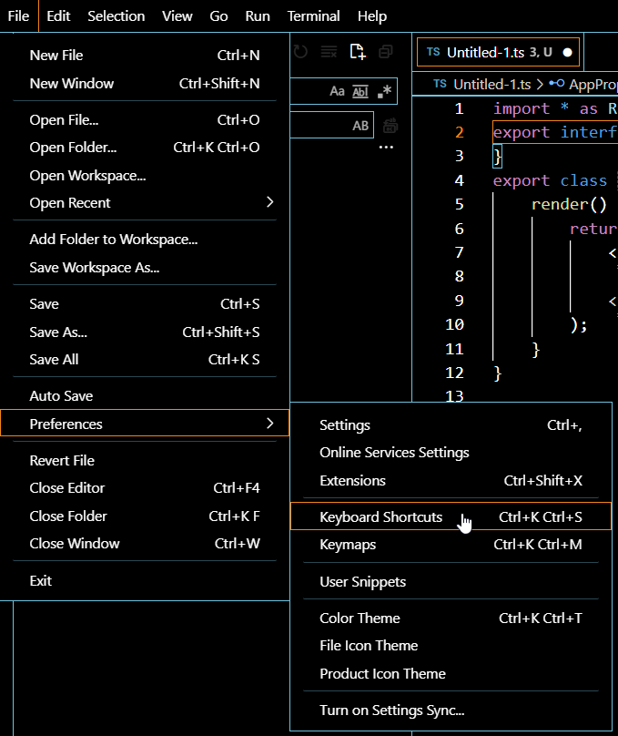

or 

* Сlick **Manage** and choose **Keyboard Shortcuts**. 

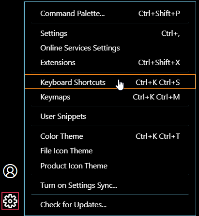

2\. Find the **CodeRush.expandSnippetWithOther** command, select it, and click **Change Keybinding** (the default shortcut for this command is **Ctrl + Space**).  

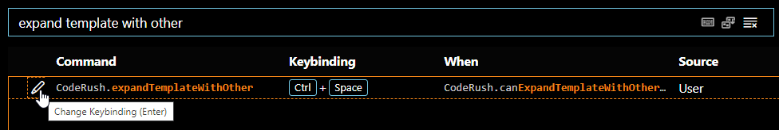

3\. In the dialog, press the keyboard shortcut to bind to this command and press **Enter**. 

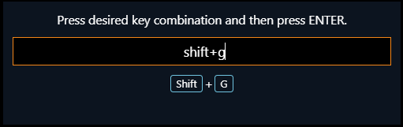

4\. Open the Visual Studio Code settings. To do this, go to the **File** | **Preferences** | **Settings** menu item or click  **Manage** and choose the **Settings** item.

5\. Open the **Extensions -> Rush Snippets** page and set the "**Trigger Rush Snippet expansion with**" option to "**Other key**" (to expand snippets with the custom shortcut bound to the **CodeRush.expandSnippetWithOther** command). 

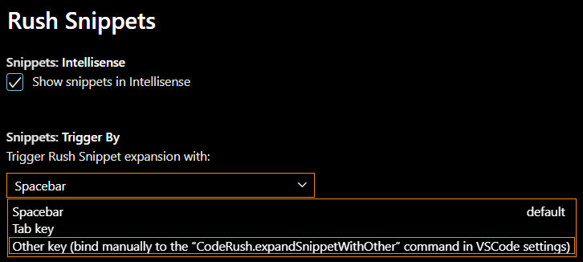

## Telemetry

Today there are many available solutions for collecting analytics; we selected [Application Insights](https://docs.microsoft.com/en-us/azure/azure-monitor/app/app-insights-overview). This service is a simple, flexible, and reliable tool for collecting and analyzing telemetry. Out of the box we get data collection on events inside the application, sessions, errors, external requests, etc. This data is often more than sufficient to determine product stability, the most-used and least-used features.

A list of least-used features can often lead to identifying discoverability gaps or perhaps issues in the feature implementation that need to be addressed.

By default, analytics collection in **Rush Snippets** is turned off.

If you are using Rush Snippets in VSCode and you would like to help us improve the extension based on anonymous usage statistics, all you need to do is check the "Enable Customer Experience Program" checkbox in the **Rush Core Settings** page.

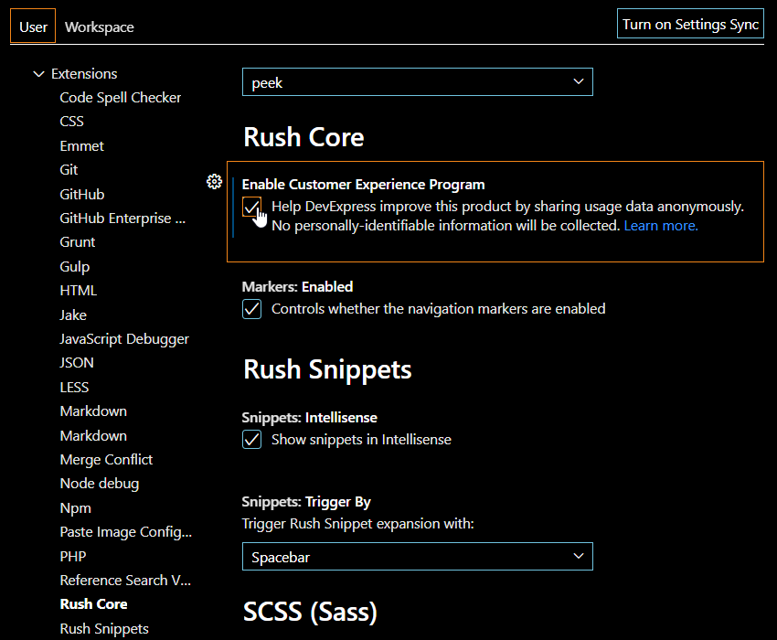

Checking this option will allow us to receive anonymous usage statistics, so we can better understand how our customers are using Rush Snippets. No personally-identifiable information will ever reach us.

I should emphasize that this checkbox is on the **Rush Core** settings page and not the **Rush Snippets** settings page. Rush Core is our root extension containing all the services needed to run Rush Snippets as well as other dev tool extensions from DevExpress.

