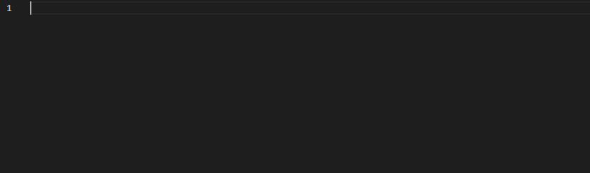
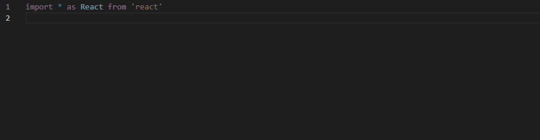
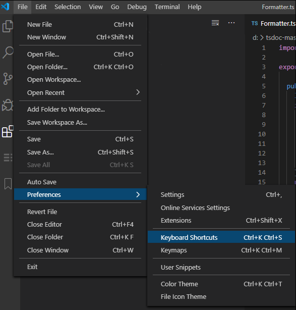
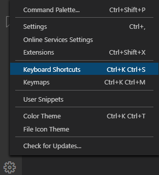
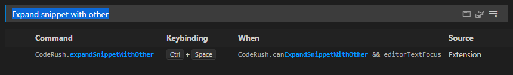
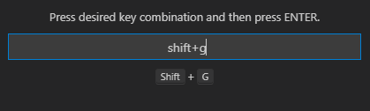
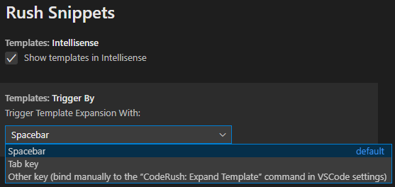

# Rush Snippets 

Code snippet templates for TypeScript, React and Redux projects. Template snippets are easy-to-recall shortcuts you type into VS Code that expand into larger blocks of boilerplate code developers create all the time. 

Rush Snippets can help you declare code more efficiently, with fewer keystrokes, fewer mistakes, less physical strain, and an overall lower cognitive load.

## Features

### Context-aware Code Creation 

**Rush Snippets** analyzes code and expands snippets appropriately depending on the surrounding context. For example, to declare a new variable that's a number, just type in "vn" ("v" for variable, "n" for number -- see, we told you it was easy to recall).

Rush Snippets includes six different expansions for this snippet, so you can use that same snippet to declare field variables, local variables, and parameters: 

Rush Snippets will even add missing commas to parameter declarations if needed.

What you get depends on where you are.

### Two Ways to Expand a Template

The **Rush Snippets** extension allows you to quickly expand a template. If you know the snippet shortcut sequence, just type it and press **Space**. 

You can also use IntelliSence to find the expansion you need. In this case, just type in a bit of what you want, and press **Enter** on the Snippet you want to expand.

### Automatic Namespace Declaration

**Rush Snippets** adds missing dependent imports (if needed by the snippet expansion) to the top of the file, next to any existing imports. It also checks if similar module imports already exist and will only adds modules that are not yet declared in the file.

### Linked Identifiers

If a snippet contains linked identifiers or repeated text that needs to stay in sync, you can quickly change that repeated text in one step. **Rush Snippets** all the links stay in sync, even if you move the caret away. 

You can break this sync by pressing **Enter** while the caret is on a link.

### Different Sequences Can Trigger the Same Expansion

**Rush Snippets** can expand templates using ultra-short sequences such as "c" (to add a class with a constructor), "rc" (to add a React component), "rpc" (to add a React Pure component), and others. If you prefer, you can also expand these same snippets by just typing in what you want to create, such as "class with constructor", "react component", and "react pure component".

## Usage

* Type a snippet shortcut where you need it, for example **c** to create a new class.

* Press **Space** or choose the snippet from IntelliSense and press **Enter** 
 **Rush Snippets** replaces the sequence with the snippet expansion. For example, creating a class with a constructor. 

* Some snippets might prompt you for changes. You'll see a highlighted box around these prompts. Just type in what you need and press **Enter** to move to the next prompt (if any). 

The screencast below shows "c" and "afn" template expansions:

You can also expand a template with the **Tab** key, or a different custom keyboard shortcut if you prefer.

## Code Snippets

The following tables list all available templates for TypeScript, React and Redux:

### TypeScript Snippets

#### Type Creation

| Template  | Description  | 
|---|---|
| **c**, **class with constructor**  | Creates a class with a constructor. | 
| **c,**, **class without constructor**  | Creates a class without a constructor. |                         | **ci**  | Creates a class that implements an interface with a constructor. | 
| **ci**, **class with implements**  | Creates a class that implements an interface with a constructor. |
| **ci,**,  **class with implements without constructor** | Creates a class that implements an interface without a constructor. |
| **cx**, **class with extends**  | Creates a class with a constructor that extends another class.   |
| **cx,**, **class with extends without constructor**  | Creates a class without a constructor that extends another class.   |
| **i**, **interface**  | Creates an interface. |
| **t**, **type literal**  | Creates a type literal. |
| **t,**, **type simple literal**  | Creates a type simple literal. |
| **tu**, **type union**  | Creates a union type. Press Enter to add more type unions. Press Escape when done. |
| **e**  | Creates an enum. |
| **cc**  | Creates a constructor. |

#### Type Reference

| Member Kind  | String   | Number| Boolean | Object| Any | Clipboard| Void |
|---|---|---|---|---|---|---|---|
| **Type Reference** | ts | tn | tb | to | ty| tp|tv |
| **Type Array Reference**|  tas | tan | tab | tao | tay| tap| -  |

#### Members Declaration

##### Properties and Functions

| Member Kind  |String   | Number| Boolean | Object| Any| Clipboard | Void |
|---|---|---|---|---|---|---|---|
| **Property**  |  ps | pn | pb | po | py| pp| - |
| **Property - Array of** | pas | pan | pab | pao | pay| pap| -  |
| **Read-only Property** | rs | rn | rb | ro | ry| rp| - |
| **Read-only Property - Array of** | ras | ran | rab | rao | ray| rap| - |
| **Function** | fs | fn | fb | fo | fy| fp|f |
| **Function - Array of** | fas | fan | fab | fao | fay| fap|  |
| **Arrow Function** | afs | afn | afb | afo | afy| afp| af |
| **Arrow Function - Array of** | afas | afan | afab | afao | afay| afap| - |
| **Async Function** | yfs | yfn | yfb | yfo | yfy| yfp| yf |
| **Async Function - Array of** | yfas | yfan | yfab | yfao | yfay| yfap| - |
| **Async Arrow Function** | yafs | yafn | yafb | yafo | yafy| yafp| yaf |
| **Async Arrow Function - Array of** | yafas | yafan | yafab | yafao | yafay| yafap| - |

##### Constants, Variables, Fields, and Parameters

| Member Kind  | String   | Number| Boolean | Object| Any| Paste |
|---|---|---|---|---|---|---|
| **Constant**  | qs | qn | qb | qo | qy| qp|
| **Constant of Array of**  | qas | qan | qab | qao | qay| qap|
| **Variable/Field/Parameter**  | vs | vn | vb | vo | vy| vp|
| **Variable/Field/Parameter of Array of**  | vas | van | vab | vao | vay| vap|
| **Variable/Field/Parameter of Array of initialized to []**  | nas | nan | nab | nao |nay | nap|
| **Variable/Field/Parameter with a new**  | ns | nn | nb | -  |na | np|

##### Declaring New Maps

| Key ▼ + Element Type ► | String   | Number| Boolean | Any| Clipboard Paste |
| string  | nmss | nmsn | nmsb | nmsy | nmsp |
| number  | nmns | nmnn | nmnb | nmny | nmnp |
| Clipboard Paste| nmps | nmpn | nmpb | nmpy | nmpp |

#### Import/Export 

| Template  | Description  | 
|---|---|
| **im**, **import all module**  | Imports a named module. | 
| **ia**, **import all module**  | Imports everything from the specified module as an alias. | 
| **id**, **import default module**  | Imports a default module. | 
| **ip**, **import module part**  | Imports a module part. | 
| **ipa**, **import module part as alias**   | Imports a named part as an alias. | 
| **xd**, **export default declaration**  | Exports a default declaration. |
| **xp**, **export module portion**  | Exports a module portion.  |
| **xpf**, **export module portion from**  | Exports a declaration portion from a specified module.  |
| **xf**, **export function**  | Exports a function. |
| **xdf**, **export default function**  | Exports a default function. |
| **xc**, **export class without constructor**  | Exports a class with a constructor. |
| **xc,**, **export class**  | Exports a class without a constructor. |
| **xt**, **export type literal**  | Exports a class without a constructor. |
| **xt,**, **export type simple literal**  | Exports a class without a constructor. |

#### Conditionals & Control Statements

| Template  | Description  | 
|---|---|
| **fof**  | Creates a for-of loop with an element iterator. | 
| **fi**  | Creates a for-loop with an index iterator. | 
| **fri**  | Creates a for-loop with an iterator variable named "i". | 
| **frix**  | Creates a for-loop with an iterator variable named "index".
| **frj**  | Creates a for-loop with an iterator variable named "j". |
| **frx** | Creates a for-loop with an iterator variable named "x". |
| **fry**  | Creates a for-loop with an iterator variable named "y". |
| **frz**  | Creates a for-loop with an iterator variable named "z". |
| **w**, **while**  | Creates a while statement. |
| **if**  | Creates an if statement. |
| **ife**, **ifelse**  | Creates an if-else statement. |
| **sw**, **switch**  | Creates a switch statement. | 
| **c**, **case**  | Creates a case statement. | 
| **tc**, **try catch** | Creates a try-catch block. | 
| **tcf**, **try catch finally**  | Creates a try-catch-finally block.
| **tf**, **try finally**  | Creates a try-finally block. |
| **tne**, **throw error**  | Creates a statement that throws an error. |

### TypeScript React Templates

#### Import

| Template  | Description  | 
|---|---|
| **ira**, **react import all**  | Imports as React (all). |
| **ir**, **react import namespace**  | Imports a React namespace. |
|**irra**, **react router import all**  | Imports as React Router (all). | 
|**irb**, **react import browser router** | Imports a React Browser Router. | 
|**ib**, **react import browser router and route** | Imports a Browser Router from react-router-dom. | 
|**ib3**, **react import browser router 3-part** | Imports a React Browser Router - Router, Route, and NavLink. | 
|**ib4**, **react import browser router 4-part** | Imports a React Browser Router - Route, Switch, NavLink, and Link. | 
|**ibl**, **react import link** | Imports a React Browser Router - Link. | 
|**ibn**, **react import navlink** | Imports a React Browser Router - Nav Link. | 
|**ibr**, **react import route** | Imports a React Browser Router - Route. | 
|**ibs**, **react import switch** | Imports a React Browser Router - Switch. | 
|**ipt**, **react import prop types** | Imports PropTypes. |
|**irc**, **react import component** | Import a React Component. |
|**irc,**, **react import namespace and component** | Imports  React, { Component } |
|**ird**, **react dom import namespace**| Imports a ReactDOM. |
|**irpc**, **react import pure component**|Imports a React PureComponent. |
|**irpc,**, **react import namespace and pure component** |Imports React, { PureComponent }. |
|**irfc**, **react import function component** |Imports a  React FunctionComponent |
|**irr**, **react import useRef** |Imports a React useRef. |
|**irr,**, **react import namespace and useRef** |Imports React, {useRef}. |
|**irm**, **react import memo**|Imports a React memo. |
|**irm,**, **react import namespace and memo** |Imports React, { memo }. |
|**irs**, **react import usestate** |Imports a React useState. |
|**irs,**, **react import namespace and usestate** |Imports  React, {useState}. |
|**irse**, **react import usestate useeffect** |Imports a React useState and useEffect. |
|**irse,**, **react import namespace and usestate useeffect** |Imports  React, { useState, useEffect }. |

#### Create

| Template  | Description  | 
|---|---|
|**rc**, **rc,**, **rcs,**, **react component** |Creates a React component declaration. |
|**rcs**,  **react component with state** |Creates a React component with the state declaration. |
|**rpc**, **react pure component** |Creates a React PureComponent declaration. |
|**rpcs**, **react pure component with state** |Creates a React PureComponent with the state declaration. |
|**rfc**, **react function component** |Creates a React function Component. |
|**raf**, **react arrow function component** |Creates a React arrow function component. |
|**rsf**, **react stateless function component** |Creates a React stateless function component declaration. |
|**c**, **react component constructor** |Creates a React component constructor declaration. |
|**cwm**, **react componentWillMount** |Creates a componentWillMount method declaration. |
|**cdm**, **react componentDidMount** |Creates a componentDidMount method declaration. |
|**cwum**, **react componentWillUnmount** |Creates a componentWillUnmount method declaration. |
|**scu**, **react shouldComponentUpdate** |Creates a shouldComponentUpdate method declaration. |
|**bmc**, **react bind method call** |Creates a bind method call. |
|**ss**, **react setState** |Creates a setState method call. |
|**us**, **react useState** |Creates a useState method call. |
|**ue**, **react useEffect** |Creates a useEffect method call. |

### TypeScript Redux Templates

| Template  | Description  | 
|---|---|
| **ixa**, **redux import all**| Imports as a Redux (all). |
| **ixc**, **redux import connect**| Imports a Redux connect. |
| **xc**, **redux component**| Creates a Redux component. |
| **xcd**, **redux component with dispatch**| Creates a Redux component with dispatch. |
| **xcp**, **redux component with own props**| Creates a Redux component with dispatch and ownProps. |
| **xms**, **redux map state**| Creates a mapStateToProps function. |
| **xmsp**, **redux map state and props** | Creates a mapStateToProps function with component properties. |
| **xmd**, **redux map dispatch**| Creates a mapDispatchToProps function. |
| **xmdb**, **redux map dispatch with bind**| Creates a mapDispatchToProps function with bindActionCreators. |
| **xcon**, **redux connect**| Creates a React Redux connect. |
| **xfc**, **redux function component**| Creates a Redux function component. |

### TypeScript Action Templates

| Template  | Description  | 
|---|---|
| **xac**, **redux actions create**| Exports a Redux action creator. |
| **xbac**, **redux actions bind**| Returns the bindActionCreators. |

### TypeScript Reducer Templates

| Template  | Description  | 
|---|---|
| **xr**,  **redux reducer**| Reduxes a reducer declaration. |
| **xcr**, **redux combine reducers**| Reduxes a combineReducers declaration. |

### TypeScript Middleware Templates

| Template  | Description  | 
|---|---|
| **mw**, **middleware function**| Creates a Middleware function. |
| **mwcl**, **middleware crash logger**| Creates a crash logger middleware. |
| **xcs**, **redux create store** | Creates a Redux store. |
| **xcsm**, **redux create store with middleware** | Creates a Redux store with middleware.

### TypeScript Console Templates

| Template  | Description  | 
|---|---|
| **clt**, **console time**| Creates a console log time. |
| **cli**, **console info** | Creates a console log info. |
| **cle**, **console error** | Creates a console log error.
| **clx**, **console exception** | Creates a console log exception.
| **cl**, **cl&#96;**, **console log backtick** | Creates a Simple console.log call (backtick quotes).
| **cl'**, **console log string** | Creates a Simple console.log call (single quotes).
| **cl&#92;**, **console log string** | Creates a Simple console.log call (double quotes).
| **cl-**, **console log instance** | Creates a Simple console.log call.
| **cloo**, **console object object** | Creates a console.log call sending out the specified value as a string.

## Customization

### Add a Custom Keyboard Shortcut to Expand a Template

1\. Open the **Keyboard Shortcuts** editor:

* Select the **File** | **Preferences** | **Keyboard Shortcuts** menu item 

or 

* Сlick **Manage** and choose **Keyboard Shortcuts**. 

2\. Find the **CodeRush.expandSnippetWithOther** command, select it, and click **Change Keybinding** (the default shortcut for this command is **Ctrl + Space**).  

3\. In the dialog, press the keyboard shortcut to bind to this command and press **Enter**. 
   

4\. Open the Visual Studio Code settings. To do this, go to the **File** | **Preferences** | **Settings** menu item or click  **Manage** and choose the **Settings** item.

5\. Open the **Extensions -> Rush Snippets** page and set the "**Trigger Rush Snippet expansion with**" option to "**Other key**" (to expand snippets with the custom shortcut bound to the **CodeRush.expandSnippetWithOther** command). 

